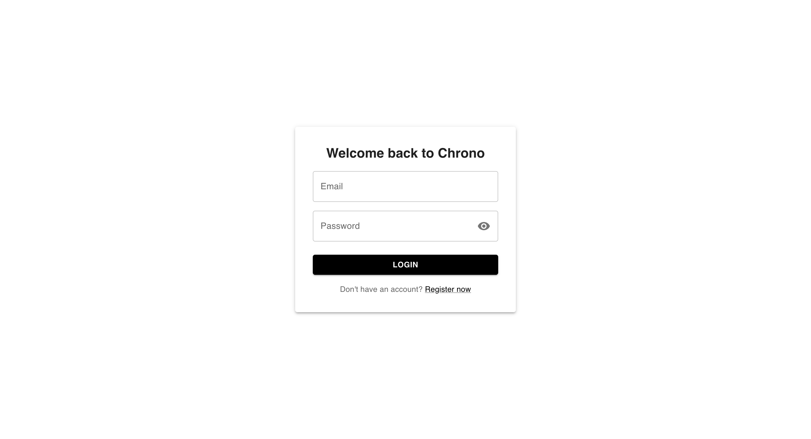

# Chrono – Calendar Application

Chrono is a modern calendar app that helps you organize your schedule, manage events, and collaborate with others. It features secure authentication, timezone management, event tagging, invitations, and advanced calendar views.

---

## Table of Contents

- [Project Structure](#project-structure)
- [Tech Stack](#tech-stack)
- [Features for Users](#features-for-users)
- [App Screenshots](#app-screenshots)
- [Folder Structure](#folder-structure)
- [Testing](#testing)
- [Testing Reports (Screenshots)](#testing-reports-screenshots)
- [How to Run](#how-to-run)
- [API Overview](#api-overview)
- [License](#license)

---

## Project Structure

```
Celander-app/
  ├── backend/      # Spring Boot Java backend (REST API, MongoDB, Auth, Business Logic)
  └── frontend/     # React.js frontend (UI, Auth, Calendar, Event Management)
```

---

## Tech Stack

- **Frontend:** React.js, Material-UI, Schedule-X (calendar), Axios, Framer Motion, React Router, Yup, Playwright, Jest
- **Backend:** Spring Boot, Spring Security (JWT), MongoDB, Lombok, JJWT, PIT (mutation testing), JUnit, Mockito
- **Testing:**
  - Frontend: Jest (unit), Playwright (E2E/system)
  - Backend: JUnit, Mockito, PIT (mutation)
- **Other:** ESLint, Prettier

---

## Features for Users

### Authentication & Profile

- **Register/Login:** Secure sign up and login with email and password
- **Password Management:** Change your password anytime
- **Timezone:** Set your preferred timezone for accurate event times
- **Session Security:** All your data is protected with modern authentication

### Calendar & Events

- **Multiple Views:** Switch between daily, weekly, and monthly calendar views
- **Event Management:** Create, edit, and delete events easily
- **Event Details:** Add tags, set priority (high/medium/low/critical), pick a color, and specify location
- **Recurring Events:** Set events to repeat daily, weekly, or monthly
- **Drag-and-Drop:** Move events to update their time/date visually

### Collaboration & Invitations

- **Invite Others:** Invite users to your events by email or by sharing a join link
- **Join Events:** Accept invitations or join via link
- **User Selection:** Assign events to multiple users

### Search & Productivity

- **Event Search:** Quickly find events by title, description, or tags
- **Reminders:** Get notified about upcoming events
- **Sidebar Navigation:** Access calendar, invitations, and settings easily

---

## App Screenshots

> **Attach screenshots below to visually showcase the main features of Chrono.**
>
> - **Login Page:** > 
> - **Registration Page:** > 
> - **Calendar (Month View):** > 
> - **Calendar (Week View):** > 
> - **Calendar (Day View):** > 
> - **Event Creation/Edit Dialog:** > 
> - **Delete Event:** > 
> - **Invitations (Accept via Invitation):** > 
> - **Invitations (Join via Link):** > 
> - **Event Search:** > 
> - **Drag-and-Drop Events:** > 
> - **Settings/Timezone Change:** > 

---

## Folder Structure

### Backend (`backend/`)

- `controller/` – REST API controllers (Auth, Event, User, Invitation)
- `service/` – Business logic (AuthService, EventService, etc.)
- `model/` – MongoDB document models (User, Event, Invitation)
- `repository/` – Spring Data MongoDB repositories
- `security/` – JWT filter, security config
- `dto/` – Data transfer objects for API requests/responses
- `exception/` – Custom exceptions and global handler
- `util/` – Utility classes (DTO converters)
- `test/` – JUnit and Mockito-based unit tests for all layers

### Frontend (`frontend/`)

- `src/`
  - `components/` – UI components (Calendar, EventForm, Sidebar, etc.)
  - `pages/` – Main pages (CalendarPage, LoginPage, RegisterPage, SettingsPage, etc.)
  - `context/` – React context for authentication
  - `hooks/` – Custom React hooks (e.g., useAuth)
  - `services/` – API service wrappers (auth, events)
  - `utils/` – Utility functions (theme, etc.)
- `test/` – Jest unit tests for components, hooks, pages
- `systemtests/` – Playwright E2E/system tests
- `public/` – Static assets

---

## Testing

### Backend Testing (JUnit, PIT)

- **Unit Tests:** Located in `backend/src/test/java/com/backend/`, covering controllers, services, models, repositories, and DTOs.
- **Mutation Testing:** PIT (pitest) is configured in `pom.xml` to ensure test quality. Run with Maven:
  ```
  mvn test           # Run all unit tests
  mvn org.pitest:pitest-maven:mutationCoverage   # Run mutation tests and generate reports
  ```
- **Test Frameworks:** JUnit 5, Mockito for mocking, PIT for mutation coverage.

### Frontend Testing (Jest, Playwright)

- **Unit Tests:** Located in `frontend/test/`, using Jest and React Testing Library.
  ```
  npm test           # Run all Jest unit tests
  npm run test:coverage   # Run tests with coverage report
  ```
- **E2E/System Tests:** Located in `frontend/systemtests/`, using Playwright.
  ```
  npm run test:playwright   # Run all Playwright E2E tests
  ```
- **Coverage:** Jest is configured for 90%+ line coverage (see `jest.config.js`).

---

## Testing Reports (Screenshots)

> **Attach your testing report screenshots below for documentation and grading.**
>
> ### Frontend
>
> - **Jest Coverage Report:** > 
> - **Jest Terminal Output:** > 
> - **Playwright E2E Calendar Test:** > 
> - **Playwright E2E Auth Test:** > 
>
> ### Backend
>
> - **PIT Mutation Report:** > 
> - **PIT Terminal Output:** > 

---

## How to Run

### Backend

1. Install Java 17+ and Maven.
2. Configure MongoDB (see `application.properties` for URI).
3. Run:
   ```
   cd backend
   mvn spring-boot:run
   ```

### Frontend

1. Install Node.js 18+ and npm.
2. Run:
   ```
   cd frontend
   npm install
   npm start
   ```
3. App runs at [http://localhost:3000](http://localhost:3000)

---

## API Overview

- **Auth:** `/api/auth/register`, `/api/auth/login`, `/api/auth/me`, `/api/auth/password`, `/api/auth/timezone`
- **Events:** `/api/events` (CRUD), `/api/events/:id/join`, `/api/events/:id/leave`, `/api/events/date-range`, `/api/events/priority/:priority`
- **Users:** `/api/users`
- **Invitations:** `/api/invitations`

All endpoints (except `/auth/*`) require JWT in the `Authorization` header.

---

## License

MIT License
